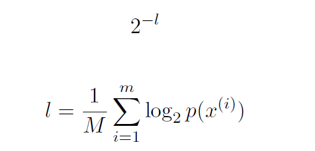
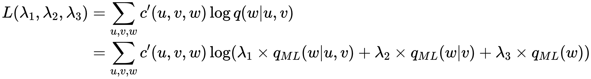
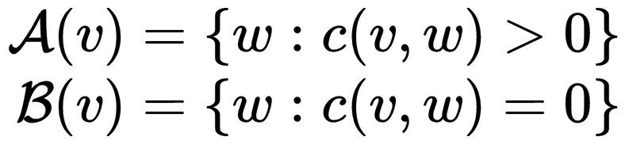
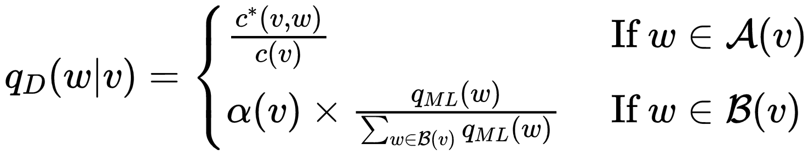
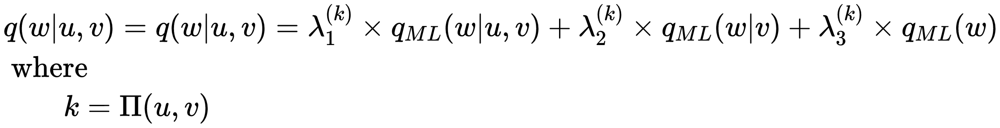
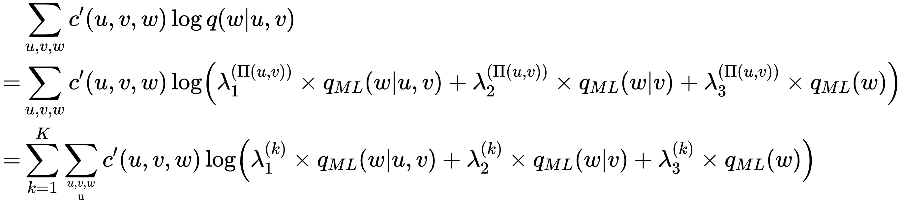

# Language Model

## Markov Processes

Our goal:

MODEL: 

p is a probability distribution of the sentences in V+

**Problem:**

It fails to generalize to sentences that have not been seen in training data.

**Why got it**
* Acoustic model generates a large number of candidate sentences, order the probability of these sentence by LM
* Function P will be useful in other contexts during the course

## Markov Model

### Introduction
* First-order Markov Model

The identity of the ith word in sequence depends only on the identity of the previous one word.

* Second-order Markov Model

The word depends on the previous two words in the sequence.

### Markov Model for Variable-length Sentences

**Under Second-order Markov ModeL**

X = (x1....xn)   xn = STOP

1. Initialize i = 1, x0 = x-1 = *
2. Generate xi from distribution:

        P(Xi = xi | Xi-2 = xi-2, Xi-1 = xi-1)
        
3. If xi = STOP, return x1...xn, Otherwise, set i = i+1 and return to step 2

### Trigram Language Model

Assume P(Xi = xi | Xi-2 = xi-2, Xi-1 = xi-1) = q(xi | xi-2, xi-1)

**KEY PROBLEM**

Estimate the parameters of the model q(w|u,v)

### Maximize-Likelihood Estimates

Define:

**c(w,u,v)**: The number of times that the trigram(u,v,w) is seen in the training corpus.

        q(w|u,v) = c(u,v,w) / c(u, v)
        
**PROBLEM**

We have a large amount of parameters in our model: q(u,v,w) & q (u,v) About **|V|^3**

*(Discuss Later)*

### Evaluating Language Models: Perplexity

"Hold out" data: not part of the corpus used to estimate the LM 

**Average log probability**

For test data:

**Perplexity**

The smaller the value of perplexity, the better the language model is at modeling unseen data

Perplexity can be thought of as the effective vocabulary size under the model.

Sometimes we use geometric mean

**PROBLEM**

We should avoid giving 0 estimates at all costs.

## Smoothed Estimation of Trigram Models

**Process sparse data**: counts c(u,v,w), c(u,v) will be low or zero

### Linear interpolation

**Some Likelihood estimates**

        qML(w|u,v) = c(u,v,w) / c(u,v)
        qML(w|v) = c(v,w) / c(v)
        qML(w) = c(w) / c(all)
        
**q(w|u,v) = λ1 * qML(w|u,v) + λ2 * qML(w|v) + λ3 * qML(w)**

    Σλ = 1
    λ1，λ2，λ3 > 0
    
#### Estimate λ

Hold out data separate from training data and testing data

c'(u,v,w) is the number of times (u,v,w) is seen in the development data

We should **argmaxL(λ1,λ2,λ3)**

In practice, if c(v,w) = 0, we need to define λ1 = 0, since q(u,v,w) = c(u,v,w)/c(v,w)

### Discounting Method
        c*(v,w) = c(v,w)-β
        q(w|v) = c*(v,w) / c(v)

.jpg)

 

We choose β from (0.1, ...., 0.9) which can maximize the Likelihood

## Advanced Topic

*Linear Interpolation with Bucketing*

Introduce a parameter **k**
 

Π is decided by c(u,v). It defines a partition of bi-grams into K different subsets.

The new λ is chosen to maximize the function.

# Chapter 1 Finish!

