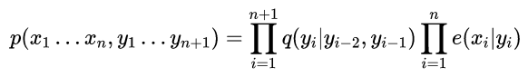
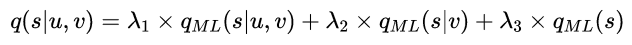
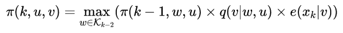
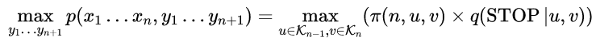
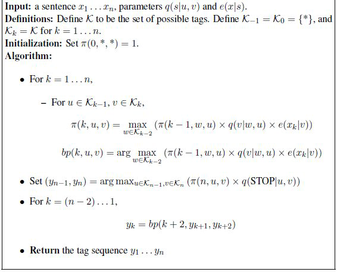

# Tagging Problems, and Hidden Markov Models

## Example

* Par-of-Speech(POS) tagging
    Goal will be to construct model that recovers PS tags for sentences with high accuracy.
    -  Challenges  
        * Ambiguity
        * Presence of words are rare
        * Two sources of evidence are in conflict
* Named-entity Recognition(NER)

## Generative Models, and The Noisy Channel Model

This chapter treats tagging problem as a supervised learning problem.

**Generative Model:**

Define a conditional probability ***p(y|x)***

output: f(x) = *arg* *max* p(y|x)

In generative model:

we instead model the joint probability p(x,y) = p(y)*p(x|y)
* p(y)is a prior probability distribution over y
* p(x|y)is the probability of generating the input x, given underlying label is y

Decompose a joint probability into terms p(y) and p(x|y) are often called noisy-channel models.

## Generative tagging Models

p(x1....xn,y1...yn) >= 0
Σ p = 1

Generative tagging model:

### Hidden Markov Model

**Trigram Hidden Markov Model**

Tri-gram HMM consists of a finite set V of possible words and a finite tags set K.

Two parameters:
1. q(s|u,v): Seeing the tag s after the bi-gram of tag(u,v). (Unobserved-hidden)
2. e(x|s): Probability of seeing observation x paired with state e.(observed)
    
        1. Sequence y1...yn is a second-order Markov sequence
        2. Xi depends only on the value of Yi

We define the probability for any (x1...xn, y1...yn):

**HMM is derived from variable-length Markov Model.**

### Estimating the parameters of a Trigram Model

**Maximum-likelihood**

* q(s|u,v) = c(u,v,s) / c(u,v)
* e(x|s) = c(s→x) / c(s)

We just need to read off counts from the training corpus and then compute the maximum-likelihood estimates.

**Smooth estimates of q(s|u,v)**

**Problem**

e(x|s) will be unreliable if the word x is infrequent, worse still, we have e（x|s）= 0 if x is not seen in training data

**Dealing with unknown words**

Map low frequency words in training data, and in addition words seen in test data but never seen in training, to a relative small set of pseudo-words.

Example of pseudo-words: 
* InitCap(first letter is capital)
* fourDigitNum(four digits number)

1. Define f(x) to map the low frequency words. Counts cut off γ. (always 5)
2. Transform word-to-tag to pseudo-words-to-tag.
3. Never see e = 0

### Decoding with HMMs: The Viterbi Algorithm

The problem of HMM: the possible sequences set will be large and inefficient.

Define Π(k,u,v): is the maximum probability for any sequence of length k, ending with tab bi-gram(u,v).

The running time is O(n|k^3|)

**The Viterbi Algorithm with Back-pointers**

## Summary

1. Given a training corpus from wich we can derive counts, the maximun-likelihood estimates for the parameters are

        q(s|u,v) = c(u,v,s)/c(u,v)
        e(x|s) = c(s→x)/c(s)        
2. Given a new sentence x1...xn, and parameters q and e that we have estimated from a training corpus, we can find the highest probability tag sequence for it, using Viterbi Algorithm.

