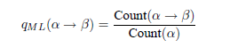
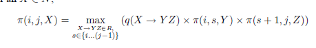

# Probabilistic Context-Free Grammars

## Basic Define

**4-tuple G = (N,Σ,R,S)**
- N is a finite set of non-terminal symbols
- Σ is a finite set of terminal symbols(e.g. words, < STOP >)
- R is a finite set of rule of form
- S is a distinguished start symbol

## Ambiguity

Some string s may have more than one underlying derivation.

## Probabilistic Context-Free Grammars(PCFGs)

### Basic Definitions

Tg is the set of possible parse trees for s
**{t: t∈ Tg, yield(t)=s}**

Key is to **extend our definition to give a probability distribution over possible derivations**

- p(t) >= 0
- Σp(t) = 1

#### Questions:
1. How to define p(t)
2. How do we learn the parameters of model of p(t)
3. How do we find the most likely tree(maximum-likelihood)

### Definition of PCFGs
A PCFG consist of
- A Context-Free grammar G=(N,Σ,S,R)
- A parameter Σq(α->β) = 1
 

#### Deriving a PCFG from a Corpus
Define a PCFG(N,Σ,S,R,q):
- N is the set of all non-terminals in tree
- Σ is the set of all words seen in trees
- S the start symbol
- R is the set of rules α->β
- Maximum-likelihood parameter estimates:

#### Parsing with PCFGs
Dynamic programming -- CKY Algorithm

**Chomsky Normal Form**

1. X is a symbol -> Y1,Y2 also symbol
2. X is a symbol -> Y is terminal symbol(words)

**Parsing using the CKY Algorithm**

Input: PCFG in CKY Algorithm

Output: Arg MAX(t) : p(t)

Define: 

X ∈ N; 

1<=i<=j<=n: set of all parse trees for words such that X is the root of tree.

Thus, Π is the highest score for any parse tree that dominates words, and has the non-terminal X as the root.

We can use bottom-to-up algorithm:

        
        **s is the split point to split whole tree to two trees**
1. The Π(i,i,X) values, using the base case in the recursion
2. The Π(i,j,X) values such that j = i+1
3. The Π(i,j,X) values such that j = i+2

***We take max over all possible choices of rules and split points***

**The Inside Algorithm for Summing over Trees**
WE simply replace the max in the previous definition of Π with a sum.

